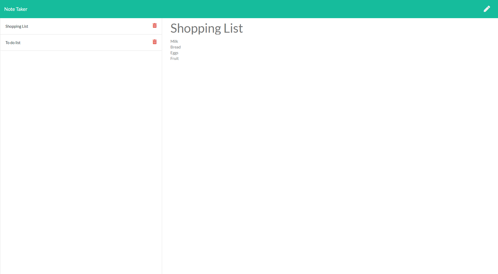

# Note Taker  
 
## Description
Having been given the front end code for a note taking app, the task was to create the back end functionality, creating the routes on a server to allow the page to function as expected.   

## Table of Contents
  - [Note Taker](#note-taker)
  - [Description](#description)
  - [Table of Contents](#table-of-contents)
  - [Installation](#installation)
  - [Usage](#usage)
  - [License](#license)
  - [Contributors](#contributors)
  - [Technologies Used](#technologies-used)
  - [Future versions](#future-versions)

## Installation
Initiate the app by opening the terminal, and running npm install, followed by node server.js, then navigating to the browser at locl host:3000. Or accessing at heroku.

## Usage
After navigating from the home page to the notes page, the user can add notes, save them, and delete them.

A screenshot of the rendered html page is shown below.

## License
License with MIT

## Contributors
This app is the sole work of [Claire](https://github.com/ClaireMDavies)

## Technologies Used
- Javascript
- node.js
- express npm
- path npm
- fs npm
- uuid v4 npm
  

## Future versions
Given that the front code was already supplied, I was frustrated with the browser side functionality, and would make it more useable such as having the ability to go back and edit notes, along with being able to submit a note to save on the keystroke of the enter key.  

